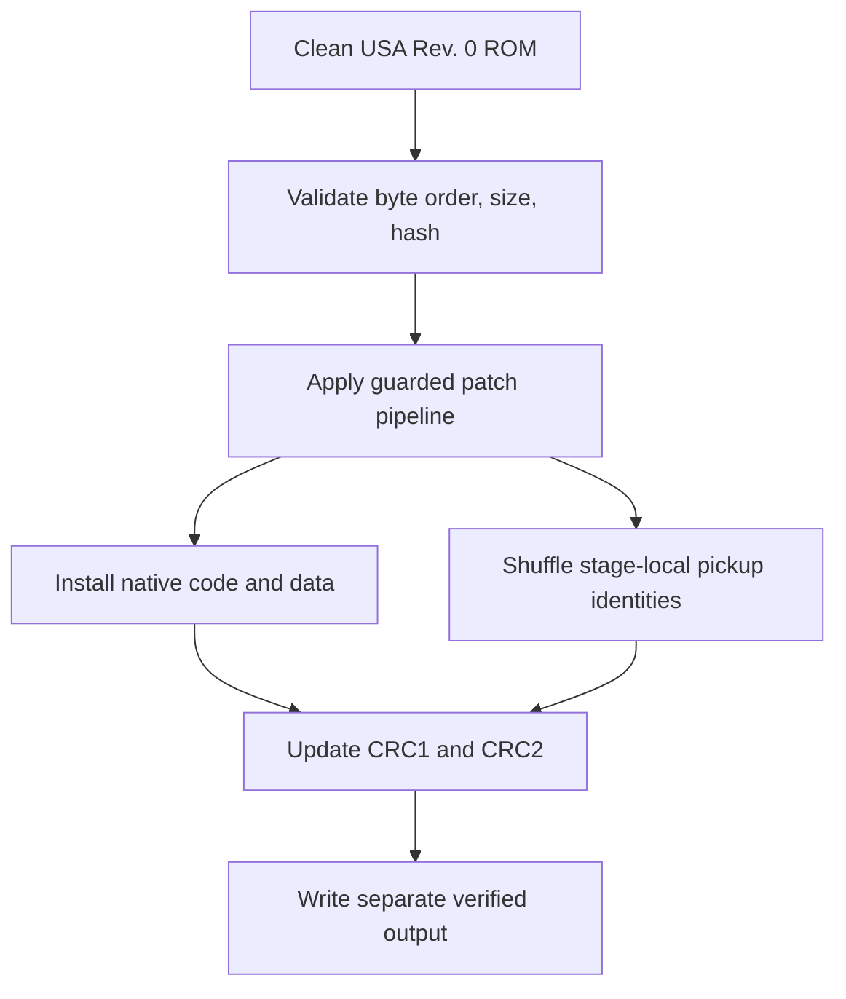

# Architecture overview

## Product boundary

MKMSZR is an offline patch generator. The browser and CLI collect configuration and call the same Python core; neither uploads nor bundles a ROM. The output is a full patched ROM with corrected header checksums.

## Static patch layer

Patch modules own small, guarded edits: title-menu routing, arena-bound changes, file-table registration, hooks, inventory routines, UI wrapper, text, flow branches, and optional palette words. `RomImage` tracks changed spans and raises on an unexpected source byte. The product assumes big-endian words throughout.

## Native runtime layer

Two arena-start immediates move the original start from `0x801AF420` to `0x801AF820`, reserving exactly 1 KiB:

| Range | Purpose |
|---|---|
| `0x801AF420..0x801AF71F` | 0x300-byte production runtime V2 code region |
| `0x801AF720..0x801AF81F` | 0x100-byte production runtime V2 persistent state |

File ID `0x1B` in the global file table describes a payload stored at ROM `0x00F10000`. The synchronous raw-file loader `0x80065D64` loads it to uncached `0xA01AF420`. A bootstrap stub at `0x8009A184` is called from `0x800663E0`. See [Core runtime and address database](Core-Runtime-and-Address-Database).

## Pickup layer

Each main stage has a fixed array of ordinary `0x30`-byte pickup records. There are 84 total. The generator shuffles the full identity slice `+0x10..+0x2B` only within its stage, leaving location/metadata and collected state at the destination. This keeps the stage-local resource selector meaningful. A deterministic rejection loop enforces the currently modeled Wind, Earth, Water, and Prison access dependencies.

The Temple Map and other scripted actors are outside this array. Cross-stage placement is not enabled because copying identity bytes alone cannot make a foreign resource resident.

After this base layout is generated, exactly nine generated Herbs identities are selected with the independent `MKMSZR:PROGRESSION:HERBS:V1` namespace and their callback is replaced by the progression callback. This post-process does not consume ordinary-pickup RNG.

## Persistence and inventory layer

The runtime state header owns one bit per ordinary pickup, grouped by native stage. A pickup-capture hook observes the manager ordinal and sets the corresponding bit; a restore hook reapplies flags when the stage manager reconstructs records. Fire uses an explicit 19-ordinal-to-16-bit translation because three manager entries are special type-4 records.

The stock ten-slot inventory remains the live gameplay window. Four ten-word backing boxes at `0x800A6048..0x800A60E7` are authoritative. Switching copies to/from the live window and masks keys from other stages as inert Glass (`0x08`) without destroying their backing values.

## Presentation layer

The box indicator hooks an existing HUD submission, executes the displaced call, rewrites the digit in `BOX 1 OF 4`, and sends native text through `0x80073E74`. Boot branding rewrites only guarded legal-screen string storage and pointers; the following two fixed logo presentations are skipped with a separate branch.

## Boundaries not yet crossed

- No production global item pool or foreign-resource planner.
- No production enemy randomizer; same-stage substitution and one bounded cross-stage resource import are proofs.
- XP progression is now in the production patch pipeline and CI-covered; the bounded Temple behavior is runtime-confirmed, while production V2 allocation and cross-stage persistence still await manual runtime validation.
- Game Over/new-run clearing of persistent MKMSZR run state remains pending across persistence, inventory, and progression.
- No finished Reverse Elbow; v6 established a stable lifecycle, while v8 still has movement and interaction defects.
- PS1 findings guide comparison but do not share N64 addresses or binaries.
